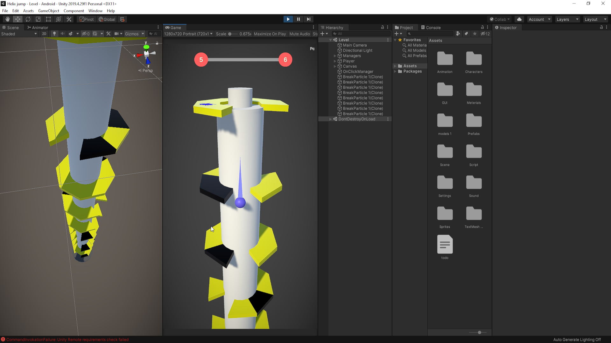

# WorkingProjects
This is a collections of pictures of my working in game development

<h2 align "left">Mr Bow</h2>

 

<h2 align "left">Helix Jump</h2>

   

<h2 align "left">Bric Breaker</h2>

   

<h2 align "left">Color Sort</h2>

  

<h2 align "left">Stick Man</h2>

  

<h2 align "left">Zig Zag</h2>

  

  
<h2 align "left">Angry Bird</h2>

 

